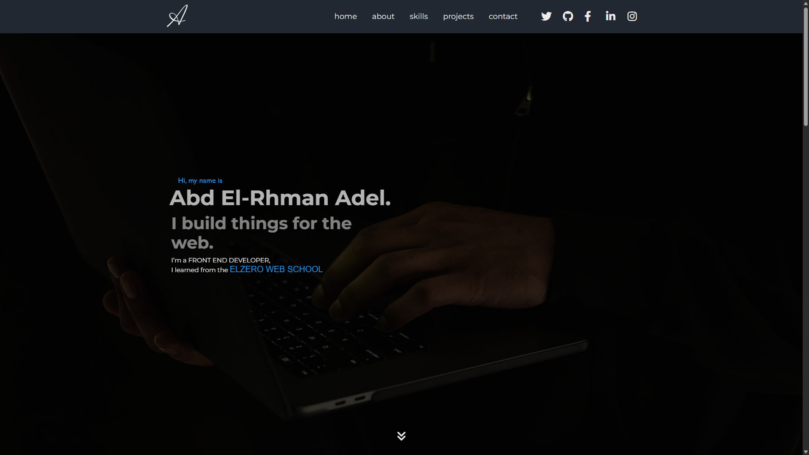
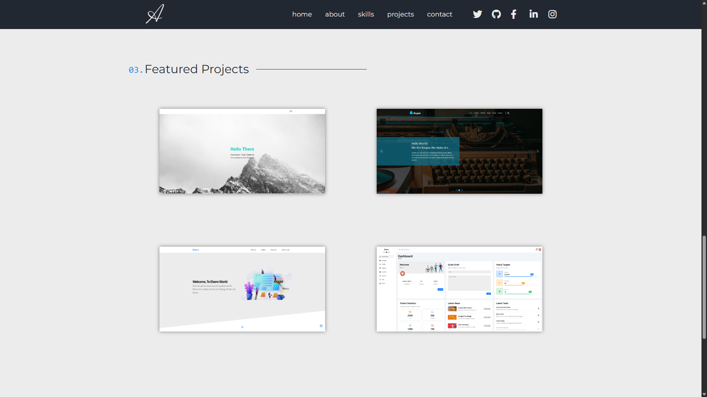

# My Portfolio 🌐

This is my personal portfolio website built with HTML, CSS, and JavaScript.  
It showcases my work, skills, and contact details in a clean and responsive layout.

🔗 **Live Website:** [My Portfolio](https://abd-el-rahman-adel-dev.github.io/My-Portfolio/)  
📁 **GitHub Repo:** [My-Portfolio Repository](https://github.com/abd-el-rahman-adel-dev/My-Portfolio)

---

## 📸 Screenshots

| Home Page | Projects Section |
|-----------|------------------|
|  |  |

> *You can add your own screenshots in a `screenshots/` folder and update the paths above.*

---

## 🛠️ Features

- Responsive design 🌍
- Smooth scroll and section highlighting 🎯
- Projects section with cards 📁
- Skills & tools overview 🛠️
- Contact form (HTML-only) 📩

---

## 🧑‍💻 Built With

- HTML5
- CSS3
- JavaScript (Vanilla)

---

## 📦 How to Use / Run Locally

```bash
git clone https://github.com/Abdelrahman_Dev/My-Portfolio.git
cd My-Portfolio
# Open index.html in your browser
```

Or just double-click `index.html` in your file manager.

---

## 📁 Project Structure

```📦 My-Portfolio
┣ 📂 css
┃ ┗ 📜 style.css
┣ 📂 js
┃ ┗ 📜 main.js
┣ 📂 images
┣ 📜 index.html

```

---

## 📄 License

This project is licensed under the [MIT License](./LICENSE).

---

## 🙋‍♂️ Author

- [Abd El-Rahman Adel](https://github.com/abd-el-rahman-adel-dev)
- [LinkedIn](https://www.linkedin.com/in/abdelrahman-adel-webdev)

---

> ⭐ If you like this portfolio, consider starring the repo and feel free to use it as a base for your own personal website.
